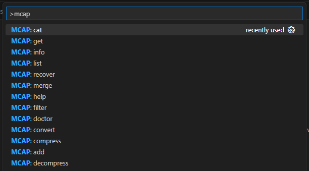
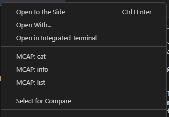

# mcap-cli-vscode README

> This extension is **not** affiliated with Foxglove.

Extends the MCAP CLI for use in VSCode. Visit the [MCAP](https://mcap.dev/) site to learn more.



## Prerequisites
- MCAP Binary

### Installation
- Recommeded installation method:
```sh
    wget https://github.com/foxglove/mcap/releases/latest/download/mcap-linux-amd64 -O mcap
    chmod +x mcap
```
- Manual method: MCAP [binary](https://github.com/foxglove/mcap/releases/latest/download/mcap-linux-amd64)

- Specific versions of the MCAP binary can be installed [here](https://github.com/foxglove/mcap/releases)

- You can install the binary in your workspace and add to your `.gitignore` file.

## Features

A command pallet of commands to run in addition to adding to the `explorer` context menu for the certain folders that drive the commands. Checkout out the previews below!

### Context Menus


- [x] `MCAP: Add` - Add records to an existing MCAP file
- [x] `MCAP: Cat` - Cat the messages in an MCAP file to stdout
- [x] `MCAP: List` - List records of an MCAP file
---
### Command Prompts
- [x] `MCAP: Add` - Add records to an existing MCAP file
- [x] `MCAP: Cat` - Cat the messages in an MCAP file to stdout
- [x] `MCAP: List` - List records of an MCAP file
- [x] `MCAP: Info` - Report statistics about an MCAP file
- [x] `MCAP: Help` - Help about any command
- [x] `MCAP: Doctor` - Check an MCAP file structure
- [x] `MCAP: Get` - Get a record from an MCAP file
- [ ] `MCAP: Compress` - Create a compressed copy of an MCAP file 🚧
- [ ] `MCAP: Decompress` - Create an uncompressed copy of an MCAP file 🚧
- [ ] `MCAP: Convert` - Convert a bag file to an MCAP file 🚧
- [ ] `MCAP: Recover` - Recover data from a potentially corrupt MCAP file 🚧
- [ ] `MCAP: Filter` - Copy some filtered MCAP data to a new file 🚧
- [ ] `MCAP: Merge` - Merge a selection of MCAP files by record timestamp 🚧

## 💻 Development

- Clone this repository
- Install dependencies using `pnpm install`
- Run the watcher with `pnpm run watch`
- Run extension in debug mode by pressing `F5` or `Ctrl + Shift + D`

## ➕ Contributing
Any contributions made are **appreciated**.

1. Fork the Project
2. Create your Feature Branch (`git checkout -b feat/<my-feature>`)
3. Commit your Changes (`git commit -m 'feat: implemented a feature'`)
4. Push to the Branch (`git push origin feat/<my-feature>`)
5. Open a Pull Request

## Extension Settings

This extension contributes the following settings:

* `mcap.mcapPath`: Enable/disable this extension.
* `mcap.clearOutputBeforeCommand`: Set to `false` to clear the terminal before executing the next command.

<!-- ## Known Issues

Calling out known issues can help limit users opening duplicate issues against your extension. -->

<!-- ## Release Notes

Users appreciate release notes as you update your extension.

### 1.0.0

Initial release of ...

### 1.0.1

Fixed issue #.

### 1.1.0

Added features X, Y, and Z. -->

---

## Following extension guidelines

Ensure that you've read through the extensions guidelines and follow the best practices for creating your extension.

* [Extension Guidelines](https://code.visualstudio.com/api/references/extension-guidelines)

## Working with Markdown

You can author your README using Visual Studio Code. Here are some useful editor keyboard shortcuts:

* Split the editor (`Cmd+\` on macOS or `Ctrl+\` on Windows and Linux).
* Toggle preview (`Shift+Cmd+V` on macOS or `Shift+Ctrl+V` on Windows and Linux).
* Press `Ctrl+Space` (Windows, Linux, macOS) to see a list of Markdown snippets.

## For more information

* [Visual Studio Code's Markdown Support](http://code.visualstudio.com/docs/languages/markdown)
* [Markdown Syntax Reference](https://help.github.com/articles/markdown-basics/)
