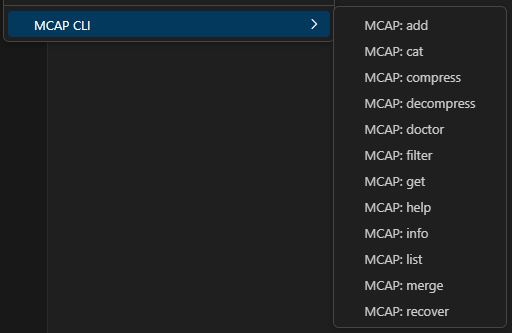
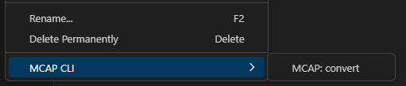

# mcap-cli-vscode

> This extension is **not** affiliated with Foxglove.

Extends the MCAP CLI for use in VSCode. Visit the [MCAP](https://mcap.dev/) site to learn more.


## Prerequisites
- MCAP Binary

### Installation
- Recommeded installation method:
```sh
    wget https://github.com/foxglove/mcap/releases/latest/download/mcap-linux-amd64 -O mcap
    chmod +x mcap
```
- Manual method: MCAP [binary](https://github.com/foxglove/mcap/releases/latest/download/mcap-linux-amd64)

- Specific versions of the MCAP binary can be installed [here](https://github.com/foxglove/mcap/releases)

- You can install the binary in your workspace and add to your `.gitignore` file.

- The cli can also be made available through mcap-cli devcontainer [feature](https://github.com/tiwaojo/features)

## Features

A command pallet of commands to run in addition to adding to the `explorer` context menu for the certain folders that drive the commands. Checkout out the previews below!

### Context Menus

#### For `.mcap` files:



#### For `.db3` files:


<!-- https://github.com/microsoft/vscode-extension-samples/issues/873 -->
---
### Command Prompts
- [x] `MCAP: Add` - Add records to an existing MCAP file
- [x] `MCAP: Cat` - Cat the messages in an MCAP file to stdout
- [x] `MCAP: List` - List records of an MCAP file
- [x] `MCAP: Info` - Report statistics about an MCAP file
- [x] `MCAP: Help` - Help about any command
- [x] `MCAP: Doctor` - Check an MCAP file structure
- [x] `MCAP: Get` - Get a record from an MCAP file
- [X] `MCAP: Compress` - Create a compressed copy of an MCAP file 
- [X] `MCAP: Decompress` - Create an uncompressed copy of an MCAP file 
- [X] `MCAP: Convert` - Convert a bag file to an MCAP file 
- [X] `MCAP: Recover` - Recover data from a potentially corrupt MCAP file 
- [X] `MCAP: Filter` - Copy some filtered MCAP data to a new file 
- [X] `MCAP: Merge` - Merge a selection of MCAP files by record timestamp 

## 💻 Development

- Clone this repository
- Install dependencies using `pnpm install`
- Run the watcher with `pnpm run watch`
- Run extension in debug mode by pressing `F5` or `Ctrl + Shift + D`

## ➕ Contributing
Any contributions made are **appreciated**.

1. Fork the Project
2. Create your Feature Branch (`git checkout -b feat/<my-feature>`)
3. Commit your Changes (`git commit -m 'feat: implemented a feature'`)
4. Push to the Branch (`git push origin feat/<my-feature>`)
5. Open a Pull Request

## Extension Settings

This extension contributes the following settings:

* `mcap.mcapPath`: Enable/disable this extension.
* `mcap.clearOutputBeforeCommand`: Set to `false` to clear the terminal before executing the next command.

## 📝 License

Distributed under the `MIT` License. See `LICENSE` for more information.